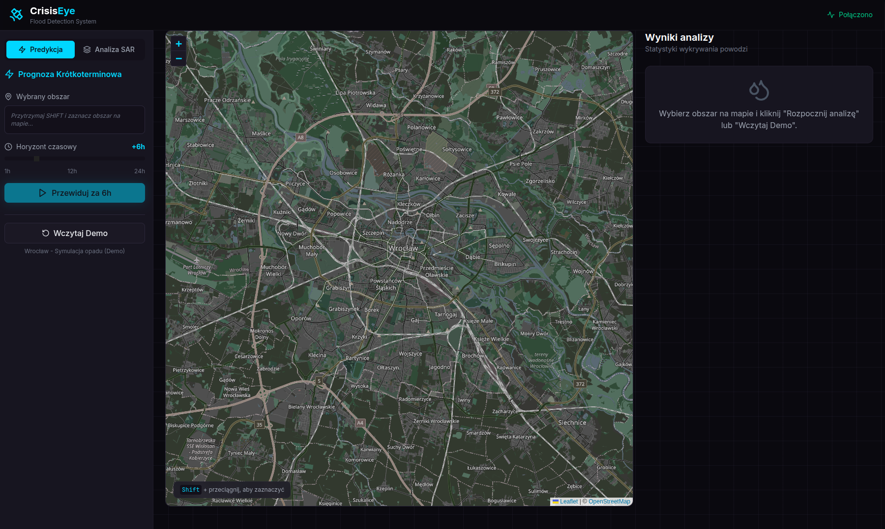

# CrisisEye 🛰️ - Flood Detection System

System do wykrywania powodzi z danych radarowych SAR dla hackathonu "AI między orbitami".


## 🚀 Quick Start

### Wymagania
- Python 3.9+
- Node.js 18+
- Docker & Docker Compose (opcjonalnie)
- Konto Google Earth Engine (dla pełnej funkcjonalności)

### Uruchomienie z Docker (zalecane)

```bash
# Sklonuj repo i uruchom
cp .env.example .env
# Edytuj .env z własnymi credentials
docker-compose up --build
```

Aplikacja będzie dostępna:
- **Frontend**: http://localhost:5173
- **Backend API**: http://localhost:8000
- **API Docs**: http://localhost:8000/docs

### Uruchomienie lokalne (development)

**Backend:**
```bash
cd backend
python -m venv venv
source venv/bin/activate  # Windows: venv\Scripts\activate
pip install -r requirements.txt
uvicorn main:app --reload --port 8000
```

**Frontend:**
```bash
cd frontend
npm install
npm run dev
```

## 📁 Struktura projektu

```
crisiseye/
├── backend/
│   ├── main.py              # FastAPI entry point
│   ├── config.py            # Konfiguracja
│   ├── models/              # Pydantic schemas
│   ├── services/            # Logika biznesowa
│   │   ├── sar_processor.py     # Przetwarzanie SAR
│   │   ├── flood_detector.py    # RandomForest detekcja
│   │   ├── building_analyzer.py # Analiza budynków
│   │   ├── gee_service.py       # Google Earth Engine
│   │   └── osm_service.py       # OpenStreetMap
│   └── routers/             # API endpoints
├── frontend/
│   ├── src/
│   │   ├── components/      # React komponenty
│   │   ├── services/        # API client
│   │   └── hooks/           # Custom hooks
│   └── ...
├── docker-compose.yml
└── README.md
```

## 🎯 Funkcjonalności

- **📡 Analiza SAR** - Przetwarzanie danych radarowych Sentinel-1
- **🌊 Detekcja powodzi** - RandomForest model do wykrywania zalań
- **🏠 Analiza budynków** - Integracja z OSM dla oceny strat
- **🗺️ Interaktywna mapa** - Wizualizacja z react-leaflet

## 🔧 API Endpoints

| Endpoint | Metoda | Opis |
|----------|--------|------|
| `/health` | GET | Health check |
| `/api/analyze` | POST | Analiza obszaru powodzi |
| `/api/buildings` | POST | Pobierz budynki z OSM |
| `/api/flood-mask` | POST | Generuj maskę powodzi |

## 🛠️ Tech Stack

**Backend:**
- FastAPI + Uvicorn
- rasterio, xarray (przetwarzanie SAR)
- scikit-learn (RandomForest)
- Google Earth Engine API
- OpenStreetMap Overpass API

**Frontend:**
- React 18 + TypeScript
- Vite
- Tailwind CSS
- react-leaflet
- Framer Motion

## Preview


